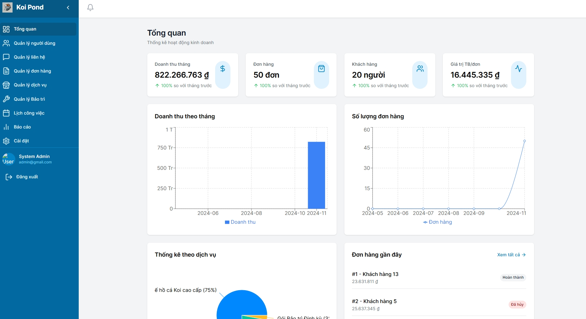
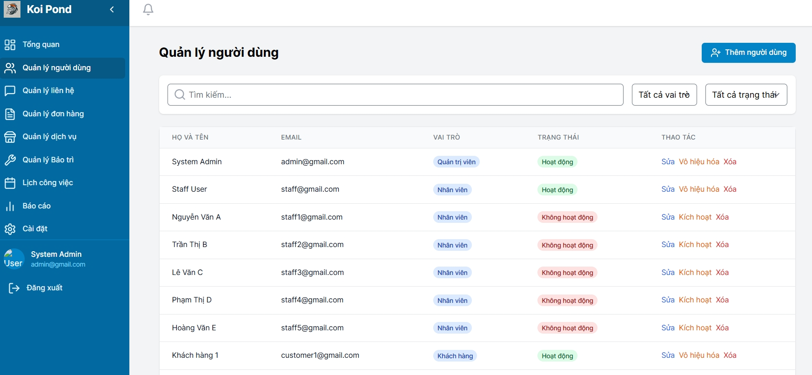

# 🎏 Koi Pond Management System

<div align="center">


_Hệ thống quản lý thiết kế và thi công hồ cá Koi chuyên nghiệp_

</div>

## 🌟 Tổng Quan

Giải pháp quản lý toàn diện cho doanh nghiệp thiết kế và thi công hồ cá Koi, tích hợp website giới thiệu và nền tảng quản lý.

### ✨ Điểm Nổi Bật

- 🎯 **Dashboard Thông Minh**: Theo dõi KPIs và phân tích dữ liệu kinh doanh trực quan
- 📱 **Responsive Design**: Trải nghiệm mượt mà trên mọi thiết bị
- 🔒 **Bảo Mật Cao**: Hệ thống phân quyền chi tiết và xác thực JWT
- 🤖 **CI/CD Pipeline**: Tự động hóa quy trình phát triển và triển khai

## 💼 Tính Năng Chính

### 🌐 Website Công Khai

- **Trang Chủ**: Giới thiệu tổng quan về dịch vụ
- **Dịch Vụ**: Chi tiết các gói dịch vụ và bảng giá
- **Dự Án**: Showcase các dự án tiêu biểu
- **Giới Thiệu**: Thông tin về công ty và đội ngũ
- **Liên Hệ**: Form liên hệ tư vấn

### 👥 Hệ Thống Quản Trị

- **Dashboard**: Thống kê và báo cáo tổng quan
- **Quản lý Đơn Hàng**: Xử lý và theo dõi đơn hàng
- **Quản lý Người Dùng**: Phân quyền và quản lý tài khoản
- **Quản lý Dịch Vụ**: Cập nhật thông tin dịch vụ
- **Báo Cáo**: Phân tích dữ liệu kinh doanh

## 🛠️ Tech Stack

### Frontend

- ⚛️ **React 18.3** | 🎨 **Tailwind CSS** | 📊 **Recharts**
- 🔔 **Sonner** | 📅 **React Big Calendar**

### Backend & DevOps

- ☕ **Java 21** | 🍃 **Spring Boot** | 💾 **SQL Server**
- 🔒 **JWT** | 📝 **Lombok & MapStruct** | 🔄 **Flyway**
- 🚀 **CI/CD** | 🧪 **Selenium**

## 🚀 Quickstart

1. **Clone repository**

```bash
git clone https://github.com/TH-NDang/JavaProject.git
cd JavaProject
```

2. **Frontend setup**

```bash
cd frontend
npm install
npm start
```

3. **Backend setup**

```bash
cd koi-pond-backend
mvn clean install
mvn spring-boot:run
```

## 🔐 Demo Access

| Role  | Email           | Password | Capabilities |
| ----- | --------------- | -------- | ------------ |
| Admin | admin@gmail.com | admin123 | Full access  |

## 📸 Demo & Screenshots

<div align="center">
<details>
<summary>📱 Click to view screenshots</summary>

### Dashboard View



### Order Management


</details>
</div>

## 📝 License

MIT License - xem [LICENSE.md](LICENSE.md) để biết thêm chi tiết.

---

<div align="center">
Made with ❤️ by Team Koi Pond

[](https://github.com/TH-NDang/JavaProject/graphs/contributors)

</div>
